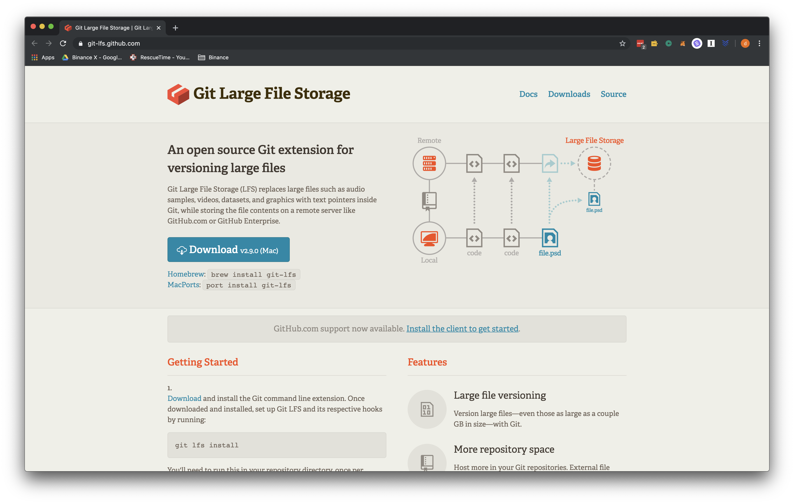
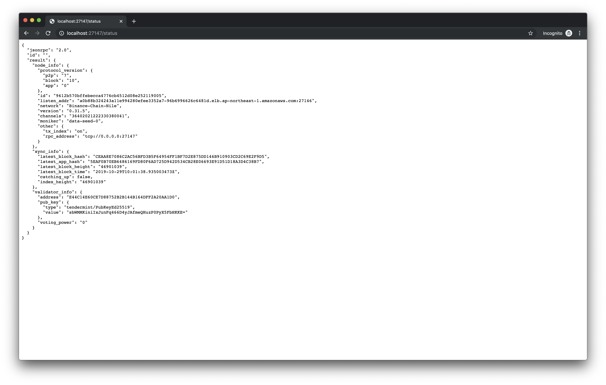
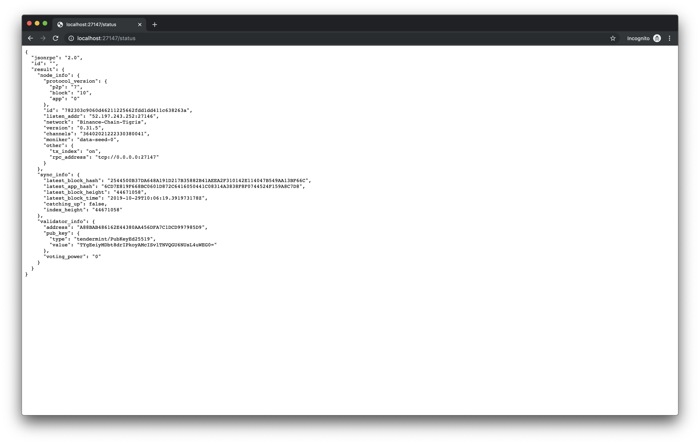

# Light Client

To run a Binance Chain node, you'll need to download a _client_ that you'll run on your local machine or server. Every node in the Binance Chain network runs the same _client_, which ensures that they know how to network and interface with each other.

Currently, Binance Chain distributes a compiled version of the _client_, which are called _binaries_. These can be found in the [`binance-chain/node-binaries` repo](https://github.com/binance-chain/node-binary).

## Installing Git LFS

The [`binance-chain/node-binaries` repo](https://github.com/binance-chain/node-binary) currently stores all versions of the node-binaries, and is a total download of >2GB.

Due to the size large size, we use [Git Large File Storage](https://git-lfs.github.com/) to only pull down the relevant version of the client when needed.



### Step 1: Install [Git LFS](https://git-lfs.github.com/)

```shell
# Mac
brew install git-lfs
```

```
git lfs install
```

https://docs.binance.org/light-client.html

If you encounter the following error, there is some issue with your `Git LFS` installation.

```
~ line 1: version: command not found
~ line 2: oid: command not found
~ <directory>: 4432 No such file or directory
```

This error occurs when your 

```
wget
```

https://github.com/binance-chain/node-binary/issues/122

#### Testnet

https://testnet-dex.binance.org/api/v1/peers

##### Run in background

```shell
./lightd 
  --chain-id "Binance-Chain-Nile" 
  --node tcp://data-seed-pre-0-s1.binance.org:80 
  > node.log  &
```
##### Run in terminal

```shell
./lightd 
  --chain-id "Binance-Chain-Nile" 
  --node tcp://data-seed-pre-0-s1.binance.org:80 
```



#### Mainnet

https://dex.binance.org/api/v1/peers

##### Run in background

```shell
./lightd 
  --chain-id "Binance-Chain-Tigris" 
  --node tcp://dataseed1.binance.org:80 
  > node.log  &
```
##### Run in terminal
```shell
./lightd 
  --chain-id "Binance-Chain-Tigris" 
  --node tcp://dataseed1.binance.org:80 
```

#### Killing a process

```shell
ps aux | grep lightd
kill -9 <pid> 
```


# Full Node

https://docs.binance.org/fullnode.html
https://docs.binance.org/exchange-integration.html#running-a-full-node

https://docs.binance.org/api-reference/api-server.html (running an API server on-machine)

-   [ ] What are the benefits of running an API server on-machine?
